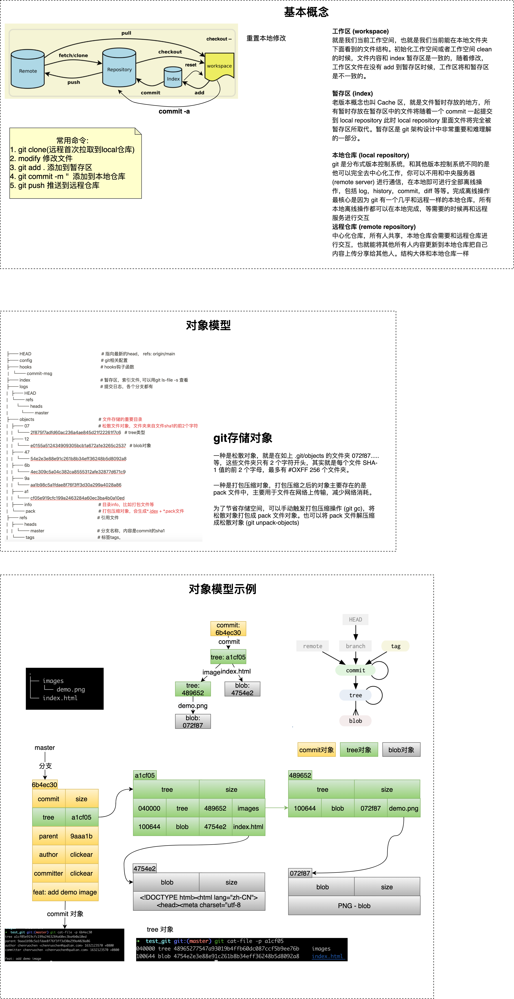

# DrawIO思维导图

# 分布式
+ 

# JAVA

## JVM
+ 基本概念
	1. 串行、并行、并发的区别
	2. TLAB
	3. 读写屏障
	4. IOCP
+ 怎么判断是垃圾
+ 垃圾收集算法
+ JVM内存布局
+ 垃圾收集器
+ 三色标记法
+ 压缩指针以及内存寻址
+ 对象结构

# 工具
## git
+ 基本概念与命令
+ 对象存储模型
+ pack文件

# 代码设计
## 设计模式
+ 单例模式 

## 设计
+ 限流器设计

+ rpc

# 项目管理

+ pmp

